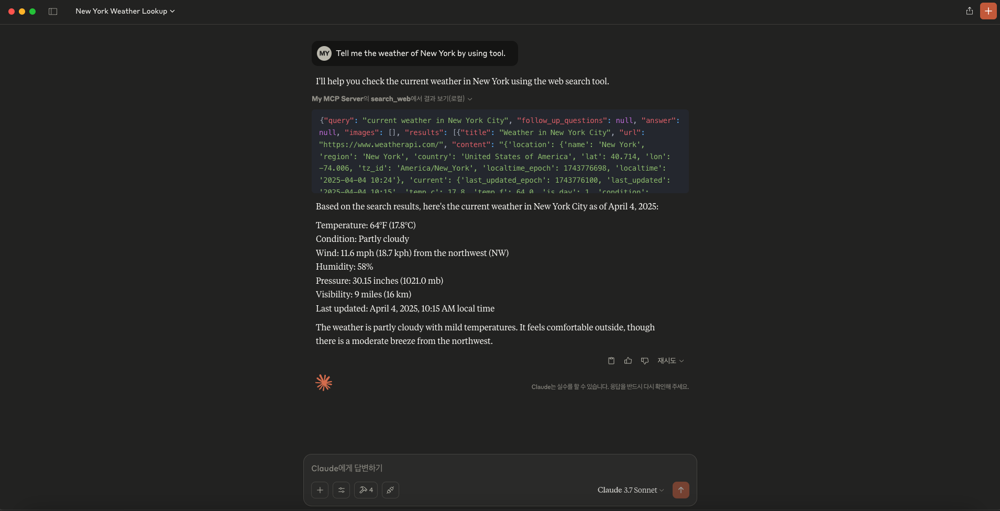
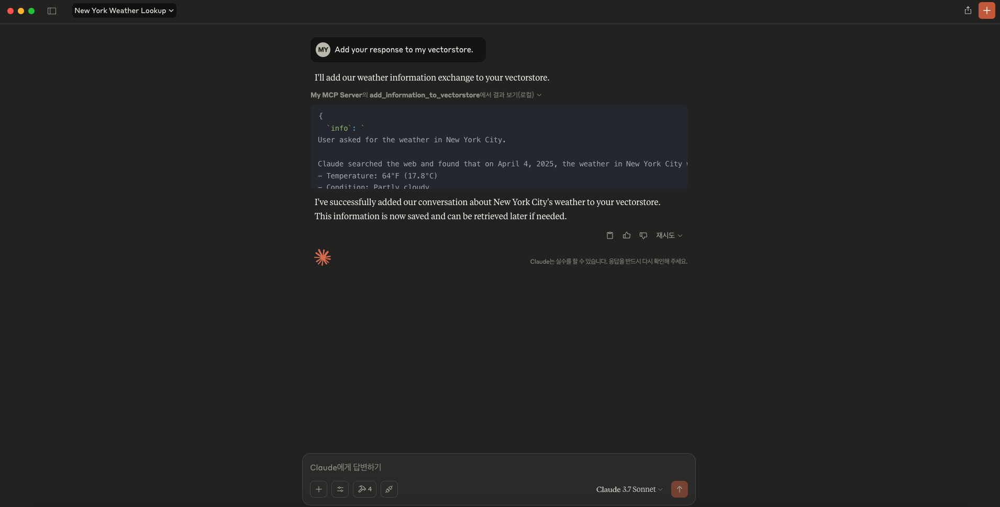
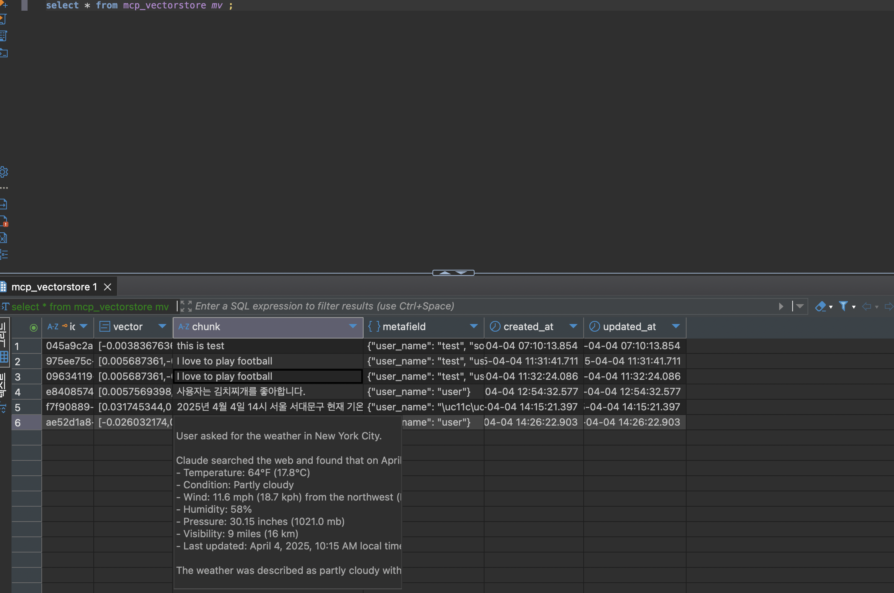

# MCP APP

This repository serves an MCP application with RAG and Web Searching tools. 
RAG tools let LLM not only retrieve knowledge from vectorstore but add documents, augmenting size of knowledge that LLM uses.

## Technology stack
- ⚙️ MCP Server Application for implementation of MCP server.
- 🧰 SQLAlchemy for the SQL database interaction (ORM)
- 🤖 OpenAI for the embedding of vectorstore.
- 💾 PostgreSQL as the SQL database.
- 🦜 PGVector as vectorstore.

## QuickStart

```sh
uv sync
source .venv/bin/activate
mcp dev run
```

## Combining Claude Desktop with MCP APP

```sh
# You must install all dependencies written in pyproject.toml
mcp install server.py --env-file .env --with sqlalchemy --with pgvector --with openai --with "psycopg[binary]" --with pydantic --with python-dotenv --with tavily-python
```

## Preview of Claude Desktop 




## TODO
- Make asynchronous implementations.
